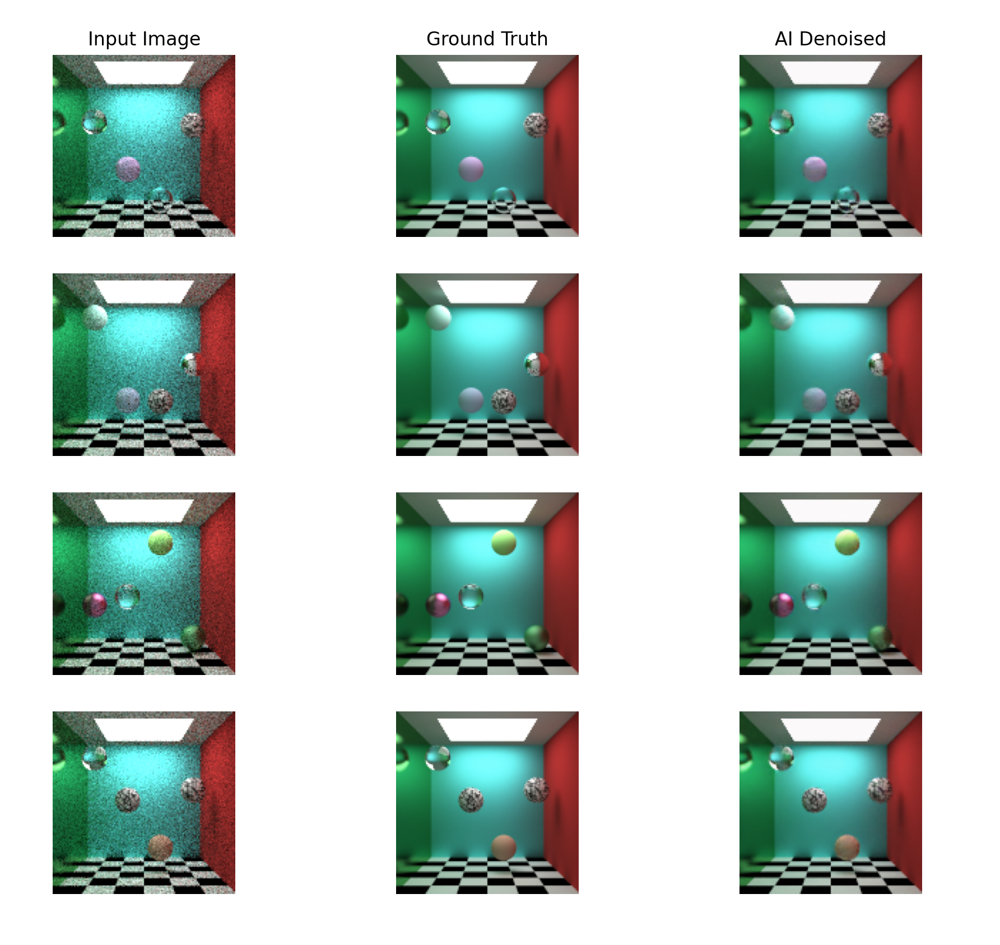

# Denoiser
Offline AI denoiser for raytraced images

## Example

### Setting up the dataset
To train the AI, make a folder called "low" in the root directory of the project and one called "high". This is where your dataset is going to go. The low folder will contain images with a target low sample count(samples per pixel), and the "high" folder should contain the same images except rendered with a high sample count. Image pairs must have the same name and placed in separate folders. There must be the same number of images in the low folder as there are in the high folder. All images must have the same resolution, I suggest starting with something low such as 128x128 or 256x256 although if you're willing to spend a few hours training, higher resolutions are possible.

### Training
Once you've setup your dataset, open a python environment with a pytorch installation(having it linked with a GPU speeds up training significantly). Then, `cd` into the root directory of this repository and run `train.py`. On my computer(GTX 1660 Super 6GB), it took 20 minutes to train on 3k 128x128 images pairs.

## Test/Usage
Once the training has finished and you get the `Successfully saved model` message. You will find a `model.pkl` under the models folder. You can now load this model in(using pytorch) and use it to denoise more images. To quickly how effective your model is, run `test.py`.